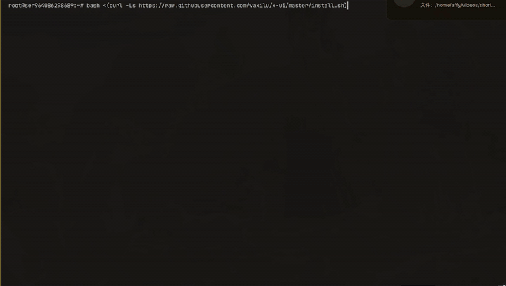
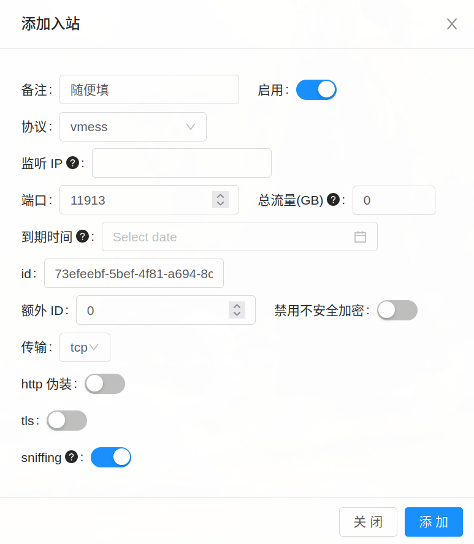
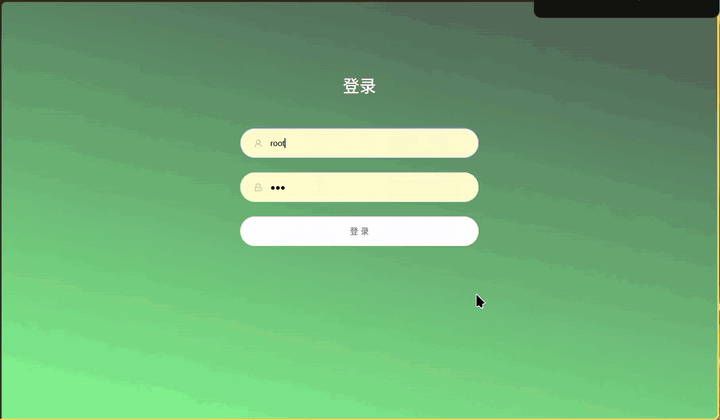

# 引言
在我们日常生活中，当我们需要访问一些被墙的网站（比如谷歌学术）或者近似被墙的网站（~~就说你呢，Github！~~）时，经常会出现无法访问的情况，很容易把我们急高兴。

正赶上最近晶哥严打节点，导致很多节点无法正常使用（~~我的机场就挂了，我刚续的费啊😭~~）为了方便，于是就有了这么一篇简明教程 
> 温馨提示：在开始之前，请注意要遵守当地法律法规，合理合法地使用这些工具。

# 简介
本教程采用了 X-UI + X-Ray 来搭建vless节点。看这篇教程不要问诸如 “为什么这样？”，“这个原理是什么？”的问题，照着做就行了。
x-ui 是一个支持多协议多用户的 xray 面板，具体功能详见其Github仓库（vaxilu/x-ui）

# 教程正文
## 准备工作
1. 一个可用的互联网连接。
2. 一个可用的安装了Linux的VPS（不要用国内厂的VPS，拿国内vps搭梯子不把你请去喝茶就怪了）
3. 愿意动手的能力
4. 会使用谷歌、必应、Yandex等搜索引擎

## START
### 准备服务器 
首先到非国内厂的VPS供应商（比如 搬瓦工、DMIT、Host、Dare、Vultr）购买一个大陆外的VPS，香港，美国，日本之类的都可以
（~~实际上并不需要必须是大厂VPS，只要不用实名且服务条款中没有禁止搭VPN的国外VPS都可以~~）
> 注意：要顺利进行接下来的步骤，你的VPS需要满足以下基本要求：
- 操作系统：支持CentOS 7+、Ubuntu 16+或Debian 8+ （本文以debian12为例）
- 内存要求：至少 512 MB
- CPU要求：至少 1 核心

### 安装X-UI面板
连接上服务器的SSH，直接执行以下命令安装X-UI面板：
```bash
bash <(curl -Ls https://raw.githubusercontent.com/vaxilu/x-ui/master/install.sh)
```
（温馨提示：使用 Ctrl+Shift+V 粘贴命令）

随后跟着这个安装脚本的提示，完成安装。
（如果VPS有安全组，一定要放行面板端口和节点端口）
如图，当x-ui 管理脚本使用方法显示时就代表x-ui面板安装成功。此时就可以用 ```你的服务器IP:面板端口``` 来访问面板了，比如你的服务器ip为 ```192.168.101.21``` ，面板端口为 ```8080``` ，则访问面板的地址为 ```http://192.168.101.21:8080```

### 通过WEBUI管理节点
通过浏览器打开面板地址后，用刚刚设置的账号密码登录即可。
进入面板后，点击入站管理，点击 + 按钮添加节点，随后进行配置。

如图所示 
1. 备注：随便填
2. 协议：无特殊需求选择vmess即可（vless也可）
3. 端口：按面板默认即可（如果有安全组需要放行这个端口）
4. 其他不要动，直接点添加


随后点击详细信息，点击复制链接，将其导入到梯子客户端即可。（这一点相信大家都会）

## END
至此，你就成功完成了节点的简易搭建，可以愉快的访问谷歌学术力！（